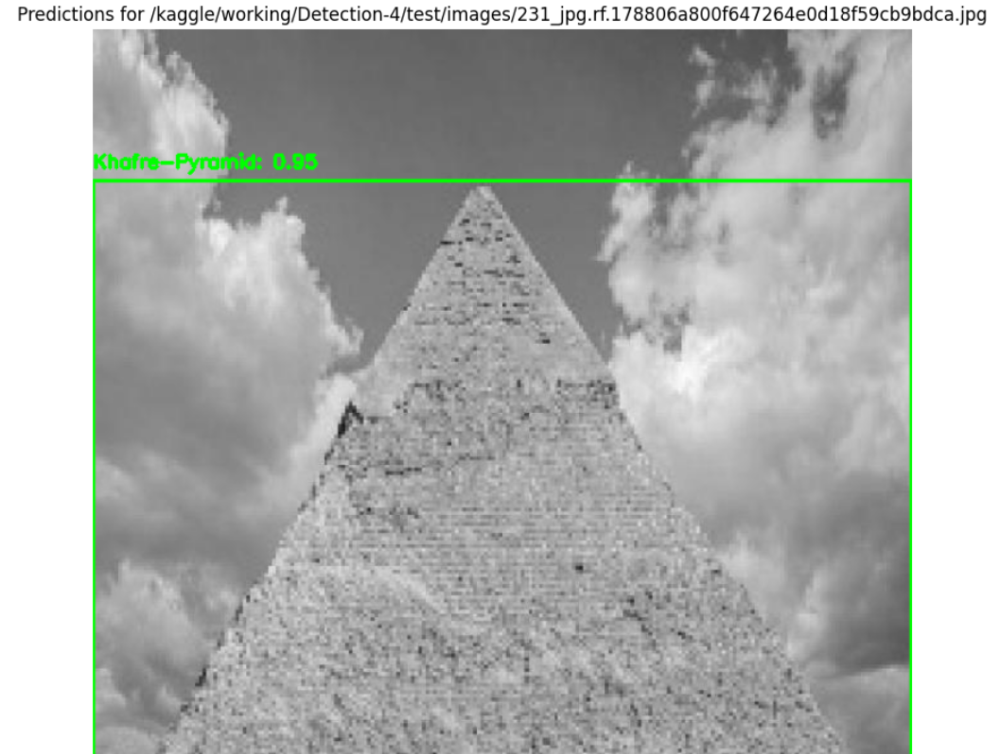
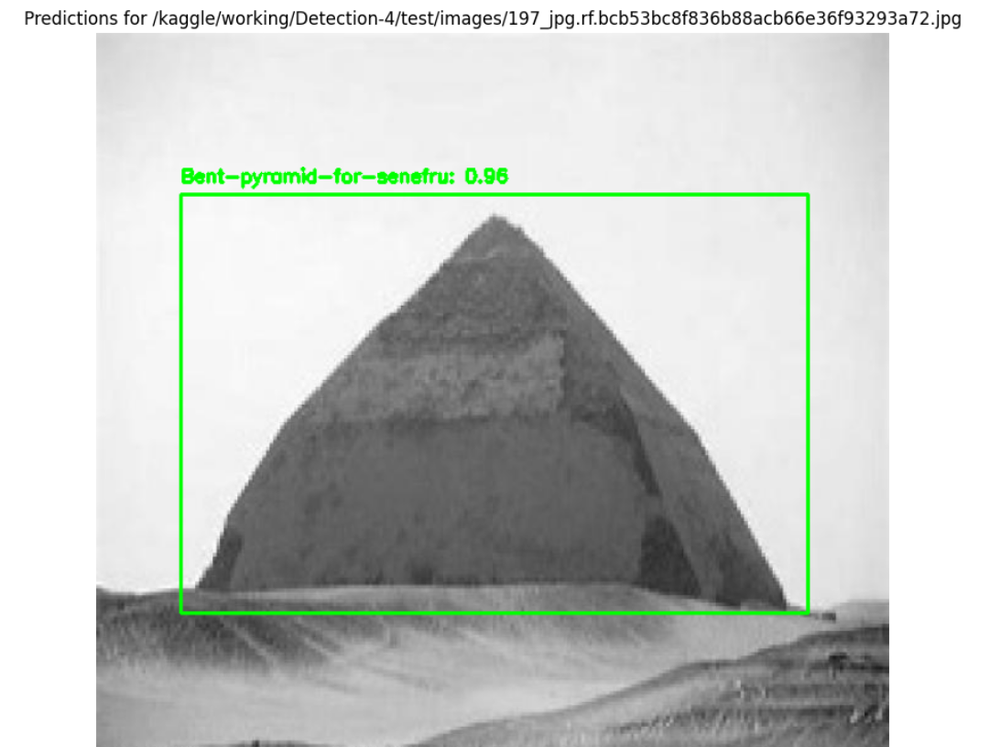
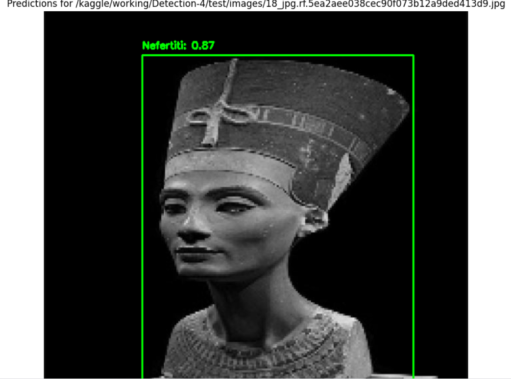
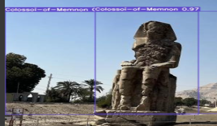
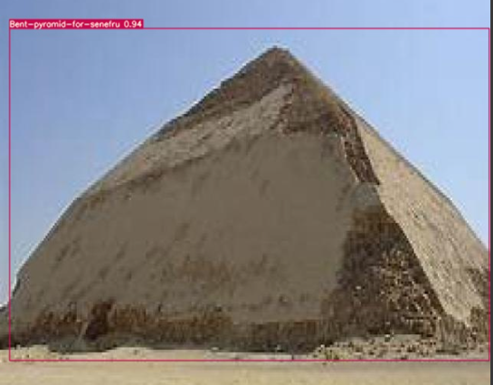

# AI-Powered Tourism Website (Horus Eye)
## Graduation Project Faculty Of Computers and Artificial Intelligence Helwan University

 

  

--- 

The project annotated dataset provided here: 

[roboflow dataset link](https://universe.roboflow.com/landmark-object-detection/detection-jsxva)

  

You can access the project from the drive link : "will be provided soon"
> ⚠ Caution: Please note that the project file size is large and may take some time to download or upload, depending on your internet connection. Ensure sufficient storage space before downloading.  
---
## Team's Contacts:

- Sarah Sameh AboBakkr (me) 
- Rawan Soudi Salah 

| **Platform** | **Link**                                                               | **Member Name**          | **Role/Description** |
| ------------ | ---------------------------------------------------------------------- | ------------------------ | -------------------- |
| **Gmail**    | [sarahsameh627@gmail.com](mailto:sarahsameh627@gmail.com)              | **Sarah Sameh AboBakkr** | Main contact         |
| **LinkedIn** | [LinkedIn Profile](https://www.linkedin.com/in/sarah-sameh-a5aba11b3/) |                          | Professional profile |
| **GitHub**   | [GitHub Profile](https://github.com/Sarah627)                          |                          | Developer            |

                      

---

## Table of Contents:
- [AI-Powered Tourism Website (Horus Eye)](#ai-powered-tourism-website-horus-eye)
  - [Graduation Project Faculty Of Computers and Artificial Intelligence Helwan University](#graduation-project-faculty-of-computers-and-artificial-intelligence-helwan-university)
  - [Team's Contacts:](#teams-contacts)
  - [Table of Contents:](#table-of-contents)
  - [Overview:](#overview)
    - [Problem Statement:](#problem-statement)
    - [Proposed Solution:](#proposed-solution)
      - [Objectives](#objectives)
  - [Challenges:](#challenges)
    - [General Constraints](#general-constraints)
    - [Data](#data)
    - [Choosing Best Model](#choosing-best-model)
      - [Model Selection Criteria for Object Detection](#model-selection-criteria-for-object-detection)
      - [Challenges and Limitations of Tested Models](#challenges-and-limitations-of-tested-models)
  - [How Did We Overcome The Challenges Of The Dataset](#how-did-we-overcome-the-challenges-of-the-dataset)
  - [Results](#results)
    - [Results from YOLOv7](#results-from-yolov7)
    - [How The Model Was Deployed](#how-the-model-was-deployed)
  - [Future Work](#future-work)
  - [Acknowledgements](#acknowledgements)
  - [References](#references)

--- 
## Overview:

project's presentation is provided here also: [presentation link](https://docs.google.com/presentation/d/1rvinPJAuQ8CUnr-7vivxsQqPMPkO_Sew/edit?usp=sharing&ouid=101102357954271133897&rtpof=true&sd=true)
### Problem Statement:
Egypt's civilization’s wealth is reflected in its historical landmarks and astonishing destinations. Exploring Egypt’s diverse cultural heritage can be a complex experience for international tourists. Typical guidebooks and online resources often fail to provide the real-time assistance and tailored insights needed to truly appreciate the wonders of Egypt. As a result, significant issues arise: tourists become uncertain about the historical value or significance of landmarks due to the sheer magnitude of options available and frustrated by the lack of seamless accommodation booking options. Additionally, the missed opportunities to experience unique journeys in Egypt are another considerable issue.

Our project aims to address key barriers to Egypt's tourism industry:

1. **`Limited Landmark Information`**: Tourists often lack up-to-date details on Egypt’s landmarks, making it difficult to appreciate their cultural significance.
2. **`Inefficient Landmark Identification`**: Without guidance, tourists may struggle to identify and explore Egypt's cultural heritage.
3. **`Fragmented Booking Process`**: Booking accommodations is often disjointed, leading to confusion and frustration for travelers.
### Proposed Solution:

Our project aimed to convert the tourism experience for non-Egyptians, empowering them to explore Egypt's landmarks with confidence, ease, and greater enthusiasm, through the seamless integration of AI-enhanced image recognition technology and a user-friendly tourism platform.

Here’s a shortened version of the objectives:

#### Objectives
In line with our goal to enhance the travel experience for non-Egyptian tourists and improve their exploration of Egypt's landmarks, our project aims to:

1. **`Develop an AI Image Recognition System`**: Create an AI-powered system to identify landmarks in Egypt from user-uploaded photos, offering real-time insights.
2. **`Ensure Seamless User Experience`**: Design an intuitive website for easy photo uploads, landmark information navigation, and accommodation booking.
3. **`Provide Landmark Information`**: Curate a comprehensive database of Egypt’s landmarks, offering historical, cultural, and geographical insights to deepen users’ appreciation of Egypt’s heritage.

--- 

## Challenges:
### General Constraints
1. **Limited** access to high-quality datasets for training machine learning algorithms.
2. **Complexity** of integrating with external APIs such as booking.com or Trivago for accommodation bookings.
3. Challenges in developing accurate and reliable AI-enhanced image recognition models for identifying landmarks.
4. **Time constraints** due to academic deadlines for project completion.
5. Resource constraints such as **limited access to computational resources** or cloud services for model training and deployment.

### Data
Our dataset posed several significant challenges that complicated its use for object detection model training:

1. **`Lack of Annotations`**
   

   1. The dataset consisted solely of raw images without any accompanying annotation files, CSV files, or metadata.
   2. This absence necessitated the manual creation of ground truth data, a process that is both time-consuming and labor-intensive.
    
   

2. **`Class Imbalance`**:
   

   1. There was a notable imbalance in object classes, with some classes being significantly underrepresented.
   2. This imbalance risks producing a biased model that performs well on frequent classes but poorly on less frequent ones, affecting overall accuracy and reliability.
   
 
3. **`Presence of Outliers`**:
   

   1. The dataset contained numerous outliers, such as low-quality images, irrelevant objects, and unusual object orientations.
   2. These outliers could introduce noise into the training process, potentially confusing the model and degrading its performance if not properly managed during preprocessing.
   
 
4. **`Lack of Preprocessing`**:
   

   1. The dataset had not undergone any preprocessing, requiring extensive steps to ensure suitability for model training.
   2. Essential preprocessing tasks included resizing, normalization, and augmentation to improve the model's ability to generalize across varied input data.
   
 
Addressing these challenges was critical for developing a robust and accurate object detection system.

- image data before preprocessing

 

- image data have inconsistent dimensions  

 

### Choosing Best Model

#### Model Selection Criteria for Object Detection

Selecting the right model for object detection involves balancing multiple factors:

- **`Accuracy`**: Measured using metrics like mAP and IoU, ensuring the model can reliably identify and localize objects.
- **`Speed`**: Important for real-time tasks, evaluated by inference time and throughput.
- **`Computational Requirements`**: Considerations include hardware needs, memory footprint, and energy efficiency.
- **`Model Complexity`**: Affects deployment and maintenance; simpler models are easier to deploy but might sacrifice performance.
- **`Adaptability`**: Ability to generalize to new tasks and data, using transfer learning and data augmentation.
- **`Support`**: Community resources, documentation, and ecosystem tools can streamline development.
- **Cost and Licensing**: Financial and legal aspects, particularly for commercial use.

#### Challenges and Limitations of Tested Models

1. **SSD**:
   - Struggles with small object detection and complex backgrounds.
   - Speed comes at the cost of accuracy.
   - Customization is labor-intensive.

2. **Faster R-CNN & Mask R-CNN**:
   - Complex architecture and long training times.
   - Issues with adapting to custom datasets, requiring significant adjustments to scripts.

3. **YOLOv7**:
   - Balances speed and accuracy, with an AP of 51.4% on our dataset.
   - Requires high hardware resources but performs well for real-time detection.

---

## How Did We Overcome The Challenges Of The Dataset 

**`Selecting an Annotating Tool`**:  
After extensive research, we chose **`Roboflow`** for its user-friendly interface, YOLOv7 PyTorch compatibility, and free plan with multiple export formats.

  

**`Data Preprocessing with Roboflow`**:  
- **Resized** images to 640x640.  
- **Greyscaled** images to reduce complexity, as color is not crucial for object detection, improving model performance.

  
  

**`Addressing Class Imbalance`**:  
Used **data augmentation** to balance the dataset and enhance model robustness.

--- 

## Results

### Results from YOLOv7

.png)

### How The Model Was Deployed

**Deployment Process**  
1. **`Environment Setup`**:  
   - Created a virtual environment to avoid dependencies conflict with previous versions and installed required dependencies (Flask, PyTorch, OpenCV) .
2. **`Flask Application`**:  
   - Developed a Flask app to handle HTTP requests and perform inference using YOLOv7.  
   - Core functionality is in `app.py`, which loads the model and processes requests.

**Key Components**  
- **`Model Loading`**:  
  - Loaded YOLOv7 model using `attempt_load` function.  
  - Model weights loaded onto the CPU.
- **`Handling Requests`**:  
  - `/predict` endpoint accepts POST requests with images.  
  - Image resized to 640x640 and converted to a PyTorch tensor for inference.  
  - Model processes the image and returns the result.

**Testing the Deployment**  
1. **`Test Setup`**:  
   - Used `requests` for sending HTTP requests and OpenCV to read and preprocess test images.
2. **`Test Image Preparation`**:  
   - Selected and resized the image to 640x640 pixels, converted to RGB, and encoded to JPEG for transmission.
3. **`Sending Image`**:  
   - Image sent via POST to the `/predict` endpoint with error handling in place.
4. **`Handling Response`**:  
   - If successful, the result was parsed from JSON and displayed.  
   - If an error occurred, the status code and error message were shown.

By following these steps, we successfully tested and validated the deployment of the YOLOv7 model, ensuring it was integrated with the Flask application and performed inference as expected.

---

## Future Work

Our focus is on improving website performance and adding features for a richer, more personalized user experience:

1. **Website Performance**:  
   - **`Optimization`**: Enhance load times and responsiveness by optimizing backend and frontend.  
   - **`Scalability`**: Implement infrastructure to handle increased traffic.

2. **Personalized Travel Recommendations**:  
   - **`User Preferences`**: Use machine learning to provide tailored suggestions based on interests like history, culture, and adventure.  
   - **`Adaptive Learning`**: Refine recommendations based on user feedback.

3. **AI-Generated Travel Content**:  
   - **`Automated Content Creation`**: Use AI to generate up-to-date travel guides, tips, and destination content.

4. **Multilingual Support**:  
   - **`Global Accessibility`**: Expand language offerings for a wider global audience.

5. **Real-time Updates**:  
   - **`Weather & Transportation`**: Provide real-time weather, flight, train, and bus updates.  
   - **`Local Events`**: Share information on local events and festivals.

6. **Food Recommendations**:  
   - **`Personalized Dining`**: Offer restaurant suggestions based on preferences and dietary restrictions.

7. **Emotion Recognition for Travel Content**:  
   - **`AI-Based Emotion Analysis`**: Use emotion recognition to personalize recommendations and create more engaging content.

These enhancements will help build a comprehensive, intuitive platform that exceeds user expectations by providing personalized, real-time information for a better travel experience.

--- 

## Acknowledgements 

To commence, we express our deepest gratitude to Dr. Ahmed Hesham for his invaluable supervision and guidance throughout the duration of our graduation project. Prof. Ahmed Hesham's unwavering support, expertise, and dedication played a pivotal role in shaping the success of our endeavor. His insightful feedback, constructive criticism, and encouragement propelled us to strive for excellence and overcome challenges with resilience.

Additionally, we extend our heartfelt thanks to our families for their unwavering support, understanding, and encouragement throughout this journey. Their boundless love, encouragement, and sacrifices provided us with the strength and motivation to pursue our academic goals relentlessly.

---

## References

| **Author(s)**                                                                                       | **Title**                                                                                  | **Source**                                                                                                              | **Link**                                                                                                                                                           |
| --------------------------------------------------------------------------------------------------- | ------------------------------------------------------------------------------------------ | ----------------------------------------------------------------------------------------------------------------------- | ------------------------------------------------------------------------------------------------------------------------------------------------------------------ |
| Girshick, R. (2015)                                                                                 | Fast R-CNN                                                                                 | In *2015 IEEE International Conference on Computer Vision (ICCV)* (pp. 1440-1448). Santiago, Chile.                     | [DOI: 10.1109/ICCV.2015.169](https://doi.org/10.1109/ICCV.2015.169)                                                                                                |
| Glenn-Jocher, & Sergiuwaxmann (2024, June 2)                                                        | YOLOV7                                                                                     | YOLOv7 - Ultralytics YOLO Docs                                                                                          | [Ultralytics YOLO Docs](https://docs.ultralytics.com/models/yolov7/)                                                                                               |
| Lihi Gur Arie, P. (2023, February 14)                                                               | The Practical Guide for Object Detection with Yolov5 algorithm                             | Medium                                                                                                                  | [Towards Data Science](https://towardsdatascience.com/the-practical-guide-for-object-detection-with-yolov5-algorithm-74c04aac4843)                                 |
| Odemakinde, E. (n.d.)                                                                               | Everything about Mask R-CNN: A Beginner’s Guide                                            | viso.ai                                                                                                                 | [viso.ai](https://viso.ai/deep-learning/mask-r-cnn/)                                                                                                               |
| Potrimba, P. (2023, August 9)                                                                       | What is Mask R-CNN? The Ultimate Guide                                                     | Roboflow                                                                                                                | [Roboflow Blog](https://blog.roboflow.com/mask-rcnn/)                                                                                                              |
| Solawetz, J. (2020, June 29)                                                                        | What is YOLOv5? A Guide for Beginners                                                      | Roboflow                                                                                                                | [Roboflow Blog](https://blog.roboflow.com/yolov5-improvements-and-evaluation/)                                                                                     |
| Solawetz, J. (2024, January 4)                                                                      | What is YOLOv7? A Complete Guide                                                           | Roboflow                                                                                                                | [Roboflow Blog](https://blog.roboflow.com/yolov7-breakdown/)                                                                                                       |
| Tsang, S.-H. (2018, November 3)                                                                     | Review of Review: ssd — single shot detector (object detection)                            | Medium                                                                                                                  |                                                                                                                                                                    |
| Vishwakarma, N. (n.d.)                                                                              | Real-Time Object Detection with SSDs: Single Shot MultiBox Detectors                       | Analytics Vidhya                                                                                                        | [Analytics Vidhya](https://www.analyticsvidhya.com/blog/2023/11/real-time-object-detection-with-ssds-single-shot-multibox-detectors/)                              |
| Wang, T., Zhang, K., Zhang, W., Wang, R., Rao, Y., Jiang, Z., Wan, S., & Gu, L. (2021, December 25) | Tea picking point detection and location based on mask-RCNN                                | ScienceDirect                                                                                                           | [ScienceDirect](https://www.sciencedirect.com/science/article/pii/S2214317321000962#:~:text=The%20Mask%20R%2DCNN%20loss,average%20binary%20cross%2Dentropy%20loss) |
| Wang, C.-Y., Bochkovskiy, A., & Liao, H.-Y. M. (2023)                                               | YOLOv7: Trainable Bag-of-Freebies Sets New State-of-the-Art for Real-Time Object Detectors | In *2023 IEEE/CVF Conference on Computer Vision and Pattern Recognition (CVPR)* (pp. 7464-7475). Vancouver, BC, Canada. | [DOI: 10.1109/CVPR52729.2023.00721](https://doi.org/10.1109/CVPR52729.2023.00721)                                                                                  |

